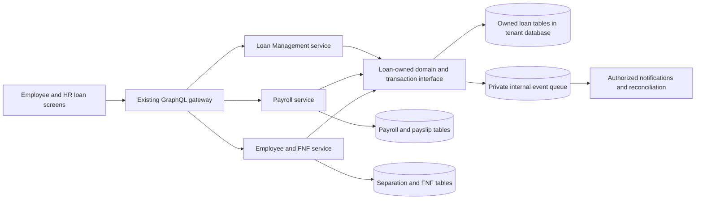

# Employee Loan Management: functional and architecture design

Date: 7 October 2026

Status: **Review draft. Requirements below are confirmed; proposed rules require review.**

Scope of this stage: architecture and functional design only. No application, database, deployment or Pencil changes are included.

Suggested review order: service/storage choice in section 3, calculation rules in section 6, payroll and exit behaviour in sections 8–9, then the decision table in section 16. Section 13 defines the screen set for the next stage.

## 1. Intended outcome and review sequence

Employees request company loans, see approved terms and recorded disbursements, and track repayments and outstanding balances. HR controls interest and recovery according to company policy and discussions with management and the employee. Payroll applies the agreed monthly recovery and produces the corresponding payslip. Before approving resignation, HR/Admin sees the employee's outstanding loans and their settlement impact and records the recovery arrangement.

The system records financial activity; it does not execute bank transfers.

The agreed sequence is: review this functional/architecture design, design the screens in `hrms-ui/designs/ui-review.pen`, review those screens, and then plan and implement the approved behaviour. Approval to prepare this document does not approve its proposed policies or authorize implementation. No commits are authorized.

### Confirmed requirements

| ID | Requirement confirmed in this discussion |
| --- | --- |
| R1 | A separate Loan Management microservice and UI module. |
| R2 | Employee request, review/approval, disbursement tracking, repayment tracking and outstanding balance. |
| R3 | Payroll recovery is selectable. HR sets the normal monthly amount and can change future amounts or override/skip a particular month. |
| R4 | HR decides interest treatment at approval under company policy. The discussion permits interest-free, a one-time charge/percentage, and reducing-balance interest. The system performs the calculations. |
| R5 | Employees see their approved terms, disbursements and repayments. |
| R6 | Payroll calculations and payslips include the actual loan deduction. |
| R7 | Loan exposure and final-settlement impact are visible before resignation approval. HR/Admin can decide how an outstanding balance will be recovered and can approve an agreed continuing arrangement. |
| R8 | Generic, company-configurable behaviour; existing UI style and guidelines. |

Everything introduced as a recommendation in this document is a proposal, not a previously agreed company policy. Rates, limits, approval chains, legal jurisdiction and existing opening balances have not been supplied.

## 2. What exists today

These are static findings from the current checkout, not claims about a deployed environment. The repositories contain unrelated work in progress, which this design preserves.

| Verified integration point | Consequence for Loans |
| --- | --- |
| Rust tenant subgraphs run as separate processes; the gateway stitches their GraphQL schemas. Services use shared PostgreSQL tenant schemas. | Add a subgraph using the established service and tenant-resolution patterns. A new service does not itself require a new database. |
| Payroll has a repeatable draft calculation, revision/fingerprint validation, and a transaction that persists payslips and marks the cycle processed. | Include loan recovery in the reviewed draft and the same finalization boundary. |
| The payroll fingerprint currently locks/hashes its explicit input tables; no loan inputs exist in that set. | Add loan version validation and a consistent lock protocol; do not leave recovery outside stale-draft protection. |
| Payroll distinguishes employee deductions from salary already paid, which reduces the remaining salary payment. | Loan recovery must have its own source-linked deduction; do not reuse the salary-already-paid field. |
| The separation approval transaction creates FNF/clearance records after approving the request. | Introduce a pre-approval financial review; adding a field only to the existing post-approval form would miss R7. |
| Existing FNF has one generic recovery amount. Its calculation floors net payable at zero; finalization marks the record processed. | Preserve a separate residual loan receivable and itemized loan recoveries. Zero employee payout must never imply the debt is settled. |
| Existing permissions, employee scopes, subscription enforcement and workflow approval mechanisms are available. | Extend those mechanisms; do not authorize financial actions merely by a role-name string. |
| The existing outbox worker dispatches tenant events to webhooks, including wildcard subscriptions. | Private loan events must not enter that broadcast path by default. |

The employee model examined is tenant-owned and does not expose a separate employer-company ID. The proposed first deployment therefore uses the existing tenant as its employer policy boundary. **If one tenant represents several lending legal entities, the employer identity model must be decided before implementation.** Cross-company lending is not inferred.

## 3. Architecture and service ownership

### Two approaches considered

| Approach | Benefits | Cost / limitation |
| --- | --- | --- |
| **A. Separate Loans service, owned tables in the existing tenant database, loan-owned transactional interface** — recommended | Fits the current platform; payroll/FNF and loan postings can commit atomically; no per-employee network calls during payroll. | Financial integration shares a versioned Rust domain/storage contract. This is not physical database isolation, and incompatible releases require coordination. |
| **B. Separate Loans service and its own database, with reservation/commit reconciliation across services** | Strong storage isolation and exclusive process-level writes. | Requires durable reservations, inbox/outbox delivery, pending payroll finalization, cancellation/compensation, reconciliation and recovery tooling. A network call alone cannot atomically finalize two databases. |

Recommendation A implements the requested separate microservice without treating the platform as if it already had isolated service databases. If physical isolation is a requirement, select B before implementation; it needs its own detailed failure protocol.

### Proposed components

- `kabipay-loans`: independently running Rust GraphQL service; public loan queries and commands, authentication, entitlement checks and permission enforcement.
- `kabipay-loans-domain`: typed terms, currency-safe calculations, schedules, allocation rules and state transitions. No dependency on Payroll or Employee service crates.
- `kabipay-loans-store`: loan-owned persistence and narrow transaction-aware operations. It receives the caller's transaction and validated actor/scope; it cannot open a second connection or commit the caller's transaction.
- Payroll and Employee/FNF call the loan-owned integration interface for quotes, validation and posting. They do not construct loan-table updates or duplicate loan arithmetic.
- The React `loans` module uses generated GraphQL operations through the existing gateway. The browser does not coordinate financial commits.

Loans owns requests, policy versions, approved terms, schedules, disbursements, loan ledger entries and loan-specific recovery arrangements. Payroll owns salary calculation, cycles and payslip snapshots. Employee owns resignation, clearance and FNF lifecycle. Existing workflow owns configured approval steps; existing Tax owns statutory benefit valuation/withholding.

The shared transaction is the financial integration boundary; the GraphQL service remains the employee/HR entry point. This storage decision must be included in the design approval.

## 4. Loan lifecycle

Avoid a single status that ambiguously combines approval, funding and repayment.

| Dimension | Proposed states / meaning |
| --- | --- |
| Request | `DRAFT`, `SUBMITTED`, `UNDER_REVIEW`, `RETURNED`, `APPROVED`, `REJECTED`, `WITHDRAWN`. Returned requests are revised and resubmitted with history. |
| Funding | `NOT_DISBURSED`, `PARTIALLY_DISBURSED`, `FULLY_DISBURSED`, `REMAINDER_CANCELLED`. |
| Servicing | `OPEN`, `CLOSED`; overdue, payroll recovery paused and post-exit recovery are separate attributes. A temporary skip does not close or forgive the loan. |
| Schedule item | Planned, partially recovered, recovered, authorized deferred or overdue, derived from effective due dates and allocations. |
| Financial record | A saved draft is not posted. Posted records are immutable; corrections reference reversing/replacement entries. |

1. Employee submits purpose, requested amount/currency, preferred repayment start and optional supporting material. Employee preferences do not determine approved terms.
2. HR reviews policy eligibility and current exposure. Approval records the approved principal ceiling, interest terms, recovery mode, first due date, normal deduction, applicable limits and the policy version.
3. The system previews the schedule and material effects before HR approves. Approval itself does not create disbursed principal or record a payment.
4. An authorized recorder confirms an external disbursement with amount, effective date, method, reference/evidence and reason where needed. Principal becomes outstanding only when this record is posted.
5. Payroll or a confirmed external receipt recovers principal/interest using the approved allocation rule. Employees can distinguish each repayment channel.
6. Close only when principal and due interest are zero, pending corrections are resolved, and any undisbursed approval is explicitly cancelled or exhausted. A later new borrowing is a new loan.

**Recommended controls:** do not allow self-approval, including an administrator's own loan. Reuse a configured single HR step or multi-step workflow rather than building a second approval engine. Each company must assign its approvers and recording permissions before activation. Changes to the proposed terms during approval invalidate approvals of the older terms version. Employee acknowledgement, if required by company policy, gates disbursement; it is separate from HR approval and is not assumed to constitute an electronic signature.

## 5. Company policy and approved terms

Policy versions are effective-dated and immutable after use. Editing policy creates a new version; existing loans retain their approved snapshot. No company name or special tenant ID appears in calculation code.

| Policy group | Explicit configuration |
| --- | --- |
| Eligibility and exposure | Eligible employment states/types, amount/tenure limits, concurrent-loan limit, employee exposure ceiling, allowed purposes, partial disbursement and approval expiry. |
| Approval | Existing workflow/required permissions, value thresholds, exception authority, employee acknowledgement/evidence requirement. |
| Interest | Allowed methods/range, annual-rate meaning, day-count method, accrual start, rounding, skip-period treatment and early-settlement charge treatment. |
| Recovery | Payroll, external receipts or mixed recovery; normal monthly amount, first recovery period/date, permitted overrides, deduction priority, take-home protection and insufficient-salary handling. |
| Exit | Authorized decision-makers, permitted carry-forward arrangements, review frequency, evidence and employee communication. |
| Operations | Currency, business calendar/timezone, receipt evidence, correction approval, retention, statement access and applicable compliance rule version. |

Approval stores resolved values, not only a pointer to a mutable policy. HR may choose permitted values or submit an explicit policy exception within their authority. Financial permission cannot override tenant ownership, immutable posted history, arithmetic reconciliation, currency compatibility or applicable legal constraints.

Required policy fields cannot silently fall back to zero/unlimited/no-interest. Policy activation validates them. Provide reviewed templates later only if approved; do not seed actual company rates or repayment limits from assumptions.

## 6. Interest and schedule calculations

### Proposed first-release calculation contract

| Method | Calculation and recognition |
| --- | --- |
| Interest-free | No interest postings. Disbursed principal is recovered through the selected channels. |
| One-time percentage | A clearly labelled total percentage, not an annual rate. Charge on each actual tranche is `tranche principal × percentage / 100`. No interest on undisbursed approval. |
| One-time fixed amount | Approved charge relates to the approved principal. Recommended partial-funding treatment: allocate it proportionally to principal actually disbursed, with the final tranche absorbing rounding residue. |
| Reducing balance | Recommended first convention: simple daily accrual on unpaid principal, annual rate with ACT/365 Fixed. For unchanged principal within an interval: `principal × annual rate / 100 × actual days / 365`. Split at disbursements, principal repayments, rate changes and approved accrual pauses. No interest-on-interest. |

The day-count convention, proportional fixed-charge treatment and repayment allocation below are **proposals for review**, not inferred policy. A field labelled only “Interest %” is insufficient: show whether it is one-time or annual and the calculation basis.

Use tenant business dates for effective activity and UTC timestamps for audit. Proposed daily convention: events take effect at the start of their value date; calculate the previous interval up to, but excluding, that date. Same-day activity follows a deterministic recorded sequence. A repayment therefore reduces the principal used for that day's subsequent accrual.

Keep high-precision accrual and rounding carry; round posted amounts to the supported currency's minor unit using a versioned rounding rule. Do not lose fractions by rounding every daily calculation independently. Store the exact rate, date interval, principal basis, rounding carry and calculator version with interest evidence. A projection uses the same calculator as a posting but does not itself write financial entries.

Before allocating a confirmed repayment or finalized payroll/FNF recovery, bring interest forward to the reviewed value date inside that same transaction. Use a locked accrual watermark and contiguous, non-overlapping calculation intervals. A scheduled period-end accrual job calls the same routine with the same idempotent interval identities; correctness cannot depend on the scheduler having run first. Reject overlapping/closed intervals and missing required rate history. Read-only payoff quotes include any earned but unposted interest explicitly and never pretend it has already been posted.

Interest strategies are typed, versioned calculations, not executable formulas supplied by a tenant. Recommended first scope permits future rate changes under the same funded-loan method with reapproval/evidence; changing the method after funding requires a separately reviewed restructuring design. Neither a rate change nor a schedule revision can remove already assessed interest or rewrite a posted repayment.

HR specifies a normal **total monthly recovery amount**, including any due interest. Recommended allocation is due interest first, then principal; the approval preview shows both columns. Other allocation orders require a reviewed policy option rather than an implicit change. A monthly amount that cannot amortize the loan, or exceeds policy tenure, blocks approval until HR changes terms or records an authorized exception with the projected residual clearly shown.

Future reducing-balance interest is an estimate. Display separately:

- Approved principal; disbursed principal; principal repaid; principal outstanding.
- Interest posted; interest repaid; accrued interest through the selected date; projected future interest.
- Current payoff amount and estimated total repayments under the present schedule.

Do not call all future projected interest “outstanding”. A one-time assessed charge is different from projected daily interest. For early settlement, reducing-balance future interest is excluded; the treatment of any remaining one-time charge must be selected in policy. First-release recommendation: no automatic early-payment penalty, no automatic waiver and no compounding.

### Deduction changes, skipped months and receipts

An effective schedule version records the normal amount and future start period. A month override references one loan and one recovery period and specifies a different amount or an explicit skip. It retains actor, reason, relevant agreement evidence and approval/acknowledgement state where configured. Finalized periods cannot be edited.

Skipping payroll does not imply an interest holiday. An explicit setting distinguishes continued accrual from an authorized accrual pause. Deferral changes future due dates/schedule; missed recovery without approved deferral remains due. The UI previews the new expected completion date and projected interest before saving.

External repayments require a recorded receipt with value date, amount, source/reference and recorder. Draft or employee-reported receipts have no balance effect until an authorized confirmation. Mixed-mode payments reduce the same loan balance; they are never a separate unreconciled “manual total”.

Financial value dates must not silently rewrite an already posted accrual or finalized payroll/FNF boundary. Earlier effective information requires a correction preview and approved adjustment at an open posting date, retaining its original occurrence date as evidence. No backdated edit deletes or recalculates a historical payslip.

## 7. Ledger, balances and financial invariants

Use an append-only loan subledger. Each financial transaction groups principal and interest entries, allocations and source references. The balance view is derived from these entries; a stored current-balance projection must reconcile to them and be updated in the same transaction.

| Event | Financial effect |
| --- | --- |
| Approval / schedule revision / payroll preview / resignation approval | No recovery or disbursement posting. |
| Confirmed disbursement | Increase principal by the amount actually recorded as paid externally; assess applicable one-time interest. |
| Interest accrual posting | Increase due interest using approved terms and recorded calculation evidence. |
| Finalized payroll recovery | Reduce due interest/principal by the actual finalized deduction, linked to cycle, employee and payslip. |
| Confirmed external repayment | Reduce due interest/principal by the accepted receipt allocation. |
| Finalized FNF set-off | Reduce due interest/principal by the itemized amount actually offset against an approved employee payable. |
| Authorized reversal/correction | New linked compensating entries; preserve the original record and source history. |

Required invariants:

1. Principal outstanding equals confirmed disbursements plus principal adjustments minus principal recoveries/reversals, using signed ledger entries.
2. Interest outstanding equals assessed/accrued interest plus adjustments minus interest recoveries/reversals. A balance cannot be silently forced to zero.
3. Total repayments reconcile to principal and interest allocations. Loan currency is constant; no implicit FX or cross-tenant netting.
4. Total disbursement cannot exceed approved principal less cancelled capacity. A reversal cannot create availability without reviewing dependent recoveries and interest.
5. Recovered amount never exceeds the current recoverable amount. For a verified receipt larger than the payoff, allocate only the payoff and record the excess as unapplied employee credit/refund due; do not discard actual money or create negative loan principal. Refund confirmation is a separate recorded external activity.
6. A submitted command has a tenant-scoped idempotency key and payload hash. Same key/same payload returns its existing result; same key/different payload fails.
7. A unique business-source key also prevents duplicate effects when a caller retries with a new request key. Payroll, FNF and accrual sources have different namespaces.
8. Each posted amount links to its originating disbursement, receipt, accrual, payslip or FNF item. Cancelling a request or approving resignation never erases these links.

Waiver and accounting write-off are not synonyms for repayment or an HR schedule change. They are outside the proposed first-release command set until authority, tax/accounting treatment and evidence are explicitly approved. Track continuing debt without inventing a waiver.

## 8. Payroll and payslip integration

### Calculation

1. Resolve loans and approved recovery terms for the employee, payroll period and explicit recovery value date. The value date is reviewed and frozen in the draft; it is not inferred from a server clock later.
2. Obtain loan-owned recovery quotes with account/employee versions, principal/interest splits, schedule version, policy version, date and amount.
3. Calculate available salary after other deductions, prior salary payments, applicable limits and configured protected take-home. Never allow loan recovery to create a negative remaining salary payment.
4. For multiple loans, use an explicit approved priority and stable tie-break; apply one employee-level recovery budget. Count recoveries already finalized for that period, including supplementary runs.
5. Show the intended amount, allowed amount and any shortfall. Recommended first behaviour: require HR review for insufficient salary; automatic partial recovery/deferral is allowed only if the company's policy explicitly selects it. A final instalment is capped to the remaining payable amount.
6. Add loan principal/interest as source-linked employee deductions. Never accept a free-text/manual `LOAN_*` line as equivalent to a ledger-backed recovery.

For clarity, proposed salary arithmetic is:

`net salary = earnings - existing employee deductions - loan recovery`

`remaining salary payment = net salary - salary already paid`

Loan principal is a receivable recovery, not an earnings component or an automatic reduction of taxable earnings. Any taxable employer-provided loan benefit is handled separately by Tax. Existing employer-cost treatment must remain unchanged.

Payroll imports that already include loan recovery must identify and reconcile the loan/source allocations before posting; do not add the computed recovery a second time. Unmapped imported loan deductions become review items. Historical opening loans must not replay old deductions into already finalized payroll.

### Finalization under recommended architecture A

Extend the existing payroll transaction: acquire the established payroll input locks, then the loan employee guards and loan account locks in stable order; reload loan input versions; reject a stale quote; persist the payslip, loan recovery allocations/ledger entries, immutable statement, audit record and private events; mark the cycle processed; commit once. Any failure rolls back the full financial operation.

All loan commands advance an employee-level loan revision, including new loans and effective policy/schedule changes. This catches a new account created after payroll calculation, not just changes to accounts that were already in the draft. Fingerprint the relevant revisions and terms; do not hash unlimited historical ledger rows for each payroll calculation.

New loan operations use the same employee/account lock protocol. Do not acquire a loan lock and then attempt to mutate payroll input tables in reverse order. FNF and separation paths must adopt the same resource ordering. Set bounded lock timeouts, return actionable retry/conflict errors and retry only the whole idempotent transaction. PostgreSQL documents the blocking and deadlock behaviour on which this proposal depends. [PostgreSQL 16 explicit locking](https://www.postgresql.org/docs/16/explicit-locking.html)

There is no financial posting during draft calculation, payslip preview, PDF generation, download or notification delivery. Proposed payroll accounting point is **finalization**, not confirmation of an external salary bank transfer; the receipt channel is labelled “Payroll deduction”. Reversing a finalized recovery requires a linked authorized payroll correction and loan reversal, not editing either balance alone.

Extend every payroll entry point that can persist a payslip. Any legacy/import/automatic path without the loan integration must fail with a review requirement when affected loans exist; it must not silently bypass loan recovery.

### Payslip contract

Persist the loan number, deduction principal, deduction interest, total deduction and opening/closing balance as of the recovery value date. The printed line can group loans compactly, with per-loan detail in the statement. Total deduction remains visible; sensitive purpose, HR notes and payment evidence are not printed.

All existing payslip templates and PDF/export paths consume this same persisted snapshot. Downloading an old slip must not replace its balance with today's live balance. Ensure component visibility settings cannot silently hide a real loan deduction while leaving unexplained net pay.

## 9. Resignation and final settlement

### Before resignation approval

Add an **Exit financial review** for a pending separation. It displays current actual principal/interest, an explicitly labelled forecast through the proposed settlement date, outstanding disbursement commitments, last payroll recovery and unfinalized payroll proposals. It also shows available FNF components and their coverage status.

Do not invent final salary, leave encashment, gratuity or other amounts that have not been calculated/approved. Unknown components are “Pending calculation”; an incomplete preview cannot be labelled a finalized settlement. A forecast is sufficient to support a documented resignation decision, but financial set-off cannot be finalized without complete authorized inputs.

HR/Admin records one or a combination of:

- Proposed recovery from final payroll and/or FNF, allocated separately by source.
- A confirmed external repayment, linked to its posted receipt.
- A continuing post-exit repayment arrangement for the remaining debt, including dates, amounts, responsible follow-up owner and agreement evidence.
- Pending finance review, which keeps the financial decision unresolved until an authorized approver resolves it.

The approval command references the reviewed loan version, separation version and decision version. It rechecks them under the common lock protocol. A changed repayment, new disbursement, rate/schedule change or last working date requires a refreshed preview; a stale modal cannot approve old numbers. The approval transaction records the decision and links it to the normal FNF/clearance artifacts.

**Resignation approval does not mean loan settlement.** It does not post a recovery or automatically close the loan. HR/Admin retains the discretion already agreed, while the financial record remains truthful.

### At FNF finalization

Separate manually entered **other recoveries** from calculated **loan recovery lines**. The aggregate remains visible for existing consumers, but the same loan amount cannot exist in both buckets. Detect/migrate existing drafts explicitly; do not reinterpret every legacy recovery as a loan.

Requote the loan at the selected settlement value date and subtract any payroll/external recovery already posted. Require review if the approved settlement snapshot has changed. Post the actual set-off and FNF finalization atomically through the loan-owned interface; approval-only earmarks and payroll drafts do not count as money recovered.

Each available payout component retains its own source and paid/settled amount. Final salary already represented in the final payroll is shown by reference and is not created again as FNF earnings. Likewise, a loan recovery already posted through final payroll cannot be included a second time in FNF. Finalization checks these source allocations under the shared transaction; a remaining salary payment and an FNF payable must not both claim the same underlying amount.

Example: loan payoff 20,000; approved available employee payable 12,000; permitted FNF loan recovery 12,000. Employee payout is zero and **8,000 remains recoverable** under the recorded arrangement. The current zero-floor behaviour must not hide that 8,000.

Track `employee_payout`, `loan_recovered_in_fnf`, `other_recoveries` and `residual_loan_receivable` independently. Do not assume every settlement component is legally available for set-off; reviewed jurisdiction/company rules define the eligible pool and limits.

Loans remain serviceable after employee exit. Stop future payroll recovery when employment/payroll eligibility ends; continue only the approved external arrangement. New disbursement after a resignation request requires explicit policy/authority; recommended first policy is to hold it for HR review. Rehire or withdrawal of resignation does not silently restore the old repayment plan.

Existing offboarding can disable employee access. This design does **not** automatically reopen an exited employee's login. HR can issue an authorized statement; a restricted former-employee portal is a separate access decision in section 16.

## 10. Proposed data and interfaces

### Owned records

| Record | Key information / constraint |
| --- | --- |
| `loan_policy_version` | Tenant, effective range, typed rules, approval state, version; no overlapping active version for the same policy selector. |
| `loan_request` | Employee, requested terms, purpose, evidence references, request state, workflow ID and optimistic version. |
| `loan_account` | Tenant/employee, stable loan number, request, approved principal, currency, terms version, funding/service state, accrual watermark and rounding carry. |
| `loan_terms_version` | Immutable approved financial terms, policy snapshot, agreement evidence and effective boundaries. |
| `loan_schedule_version` / `loan_schedule_item` | Expected due dates and principal/interest projections; never substitute for posted repayments. |
| `loan_period_override` | Account, recovery period, amount/skip, accrual treatment, reason, approval and effective version; only one effective override per period. |
| `loan_disbursement` / `loan_receipt` | External transaction records, original/effective dates, amounts, references, confirmation state and evidence. |
| `loan_posting` / `loan_ledger_entry` / `loan_allocation` | Immutable financial groups, signed principal/interest entries, source links and allocation breakdown; linked reversals. |
| `loan_unapplied_credit` | Confirmed excess receipt, allocation/refund history and remaining amount; not negative debt. |
| `loan_employee_state` | Employee loan revision and synchronization guard; new accounts and changes invalidate prior quotes. |
| `loan_exit_arrangement` | Separation and loan, decision, source-specific intended recovery, residual schedule, versions and accountable owner. |
| `loan_command_receipt` / `loan_audit_event` | Idempotency result/hash; actor and before/after versions, reasons and references. |
| `loan_internal_outbox` / `loan_consumer_receipt` | Private events, per-consumer delivery/deduplication state and retry evidence. |

All ownership includes tenant identity; foreign-key relationships and unique keys include the applicable tenant boundary. Store money with fixed-precision decimal (`NUMERIC`, Rust `Decimal`), never binary float. Suggested storage supports four fractional digits, but activation must match the current payroll currency/minor-unit contract; unsupported currency precision is rejected rather than silently rounded. Rates, calculation precision and monetary display precision are separate.

Index employee/open-loan access, due-date queues, request status, `(loan_id, sequence)`, source keys and separation arrangements. Use cursor pagination and complete server-generated exports. Financial rows have no cascade deletion from an employee/profile removal. Audit visibility and retention follow authorized policy.

### Proposed API surface

| Queries | Commands |
| --- | --- |
| `myLoans`, `loanAccounts`, `loanRequestQueue` | Save/submit/withdraw request; approve/return/reject through configured workflow |
| `loanAccount`, `loanStatement`, `loanSchedulePreview` | Record/confirm disbursement and external repayment |
| `loanRecoveryQuote`, `loanPolicyVersions` | Approve terms revision; set future deduction or period override |
| `loanExitReview`, `loanReconciliationSummary` | Record exit arrangement; authorized reversal/correction |

Final GraphQL names follow repository naming/generation conventions. The contract requires decimal strings plus currency; stable identifiers; effective dates; explicit `expectedVersion`; mutation idempotency keys; server-derived actor/tenant; and typed financial conflicts. Employees' self queries derive the employee identity from the session. Clients cannot supply calculated balances or bypass policy by sending their own totals.

Internal integration operations are `quoteRecoveries`, `validateRecoveryQuote`, `postPayrollRecoveries`, `prepareExitReview`, `validateExitDecision` and `postFnfRecoveries`. They carry tenant, employee, trusted source, source revision, actor scope, value date and allocation evidence. Quotes are previews, not long-lived reservations.

Define business errors including `LOAN_TERMS_INCOMPLETE`, `LOAN_POLICY_UNAVAILABLE`, `LOAN_REVIEW_STALE`, `LOAN_RECOVERY_EXCEEDS_CAPACITY`, `LOAN_CURRENCY_MISMATCH`, `LOAN_SOURCE_ALREADY_POSTED`, `LOAN_CORRECTION_REQUIRED` and `LOAN_EXIT_DECISION_REQUIRED`. The UI translates them into an actionable explanation and preserves safe draft input.

## 11. Permissions, privacy and failure handling

Proposed capabilities extend the existing vocabulary: `loan:read`, `loan:submit`, `loan:approve`, `loan:disburse`, `loan:repay`, `loan:manage`, `loan:policy`, `loan:correct`, `loan:exit-review` and `loan:export`. Map them to existing SELF/authorized management scopes; do not grant the entire loan record to every manager merely because the employee is in their team. Payroll integrators see the recovery contract, not medical purposes or private agreement documents.

Employee access includes their approved terms, financial transactions, schedule changes, reasons appropriate for disclosure and outstanding balance. Internal management notes remain explicitly classified. Protect record detail, files, exports and mutation endpoints as well as navigation; possession of a UUID is not authority. Store private files through existing authorized file storage and download mechanisms. Logs/events contain correlation IDs, not bank details, medical reasons, tokens or full documents.

Reject a missing policy or unavailable balance with a visible error; do not substitute an empty loan list or zero deduction. For an enabled module, payroll finalization must prove the employee's loan state is known, including “no loans”. With recommended architecture A, the HTTP service process is not required for the in-transaction port, but its database/contracts must be available and valid.

Notifications and reporting can retry after the financial commit. Private events include source IDs and version metadata, and are consumed with per-consumer deduplication; they are **not** inserted into the current wildcard webhook distribution path. Adding a private worker handler and its operational retry/dead-letter view is implementation work, not an existing verified capability. Notification failure never repeats the deduction.

Daily reconciliation compares ledger balances, loan projections, payslip allocations, FNF allocations and external receipts. It detects missing sources, duplicate allocations and orphaned corrections; it reports exceptions and blocks affected further recovery pending resolution instead of inventing balancing entries. Monitor recovery conflicts, failed commands, unreconciled totals, stale private events and overdue accounts without publishing employee details in metrics.

Recommended module lifecycle rule: block deactivation while active obligations exist unless an explicit servicing/migration plan is approved. Subscription changes must never erase debt or silently remove a payroll deduction. This needs an operations entitlement design before rollout, rather than an undocumented authorization bypass.

## 12. Tax and jurisdiction boundary

Company discretion selects contractual terms; it does not establish the legal deductibility of salary/final-settlement amounts or the tax treatment of a loan benefit. Jurisdiction, eligible recovery bases, statutory caps, consent requirements and records retention must be selected and reviewed before enabling payroll recovery for a company.

For an Indian deployment, interest-free or concessional employer loans can create a taxable perquisite, subject to applicable rules and exceptions. Therefore, zero contractual interest must not automatically mean zero tax impact. The Income Tax Department identifies employer loan benefits in its perquisite guidance. [Income Tax Department: Perquisites](https://www.incometaxindia.gov.in/w/perquisites)

Proposed ownership: Loans supplies purpose classification, dated principal history, contractual interest and interest actually recovered; Tax applies the reviewed tax-year rule or a specifically authorized assessed benefit input. A resulting non-cash taxable benefit feeds tax calculation separately from the cash loan recovery. Do not invent exemption eligibility or current benchmark rates, or apply customer-specific thresholds in Loans. A company with unresolved applicable benefit treatment cannot be declared ready for automated payroll deductions.

## 13. UI design brief for the next review stage

Use the existing app shell, authorized navigation model, page information pattern, forms, table and overlay primitives. Proposed module has three destinations: **My Loans**, **Loan Administration**, **Policies**. Administration uses a permission-filtered task selector for Requests, Active Loans, Disbursements, Recoveries and Reconciliation. Details have shareable URLs; an employee sees only their permitted destinations.

| Screen / state to design in `ui-review.pen` | Decision/task it supports |
| --- | --- |
| Employee My Loans: empty, active and closed examples | Request a loan and understand principal, interest, repayments and upcoming deduction. |
| Request form | Enter requested amount/purpose and preferences; distinguish requested from approved terms. |
| HR request review and approval | Choose policy, principal, interest method/rate/charge, recovery mode/amount/start; preview schedule and exceptions. |
| Loan detail | Summary plus Schedule, Transactions and History; disbursement and repayment are clearly different activities. |
| Disbursement recording | Record an external payment, including partial disbursement and undisbursed capacity. |
| Repayment recording | Confirm external receipts; show allocation and excess-credit handling. |
| Monthly recovery editor | Set normal amount or month override/skip; preview changed completion date and interest. |
| Payroll review integration | Display loan lines, partial/blocked recovery, changed terms and explicit review. |
| Payslip sample | Show the actual recovery with a historical balance snapshot, using the existing approved template style. |
| Pending resignation financial review | Show current/forecast exposure, settlement coverage and HR/Admin decision before approval. |
| FNF review with residual debt | Allocate actual set-off and show continuing balance/arrangement. |
| Policy editor | Effective versions, configurable rules and validation; no misleading populated defaults. |

Apply the current approved compact UI rules: desktop controls 32 px; touch targets at least 44 px; 8 px field gaps and 4 px label gaps; table cells 6 px/8 px and headers 4 px/8 px. Preserve comfortable density, large text, dark mode and reduced motion. Read effective `appearance.css` overrides along with `semantic-tokens.css`, not just base colors. Existing fonts are Inter/Manrope with user preferences.

Use one page heading, title-adjacent Info, header actions, compact filters and right-aligned money with currency. Use a primary action appropriate to the selected task. Keep monthly editing in a focused panel rather than a giant editable register. On narrow screens, prioritize loan number, status, outstanding balance and next recovery, with expandable detail.

Design keyboard navigation, labelled fields, focus return, semantic status text, accessible tab/panel relationships and loading/empty/error/stale/permission-denied/read-only states. A refreshing failed query retains the last data with a stale notice and disables financial confirmation until refreshed. Show service problems in plain language, without implementation terminology in employee flows.

Pencil uses fictional sample data clearly marked as examples. Preserve existing boards and components; add a named Loan Management review group. Screen work and visual verification have not begun in this stage.

## 14. Acceptance examples and validation plan

Amounts below are illustrative two-decimal currency values, not company defaults.

| Scenario | Expected result |
| --- | --- |
| Approve 60,000; no disbursement | Outstanding principal is 0; approval capacity is 60,000; payroll recovers 0. |
| Disburse 60,000 interest-free; normal recovery 5,000 | Twelve planned recoveries; only finalized/confirmed recoveries reduce principal. |
| After one 5,000 recovery, skip next month | Principal remains 55,000; defer/replan according to approved terms; no fictional repayment. |
| Principal 10,000, one-time interest 10% | Full disbursement assesses 1,000 interest. Total contractual repayment is 11,000 before any recovery. |
| Approved principal 10,000, fixed charge 1,000, first tranche 6,000 | Under the proposed proportional rule, principal 6,000 plus charge 600; no charge on the undisbursed 4,000. |
| Reducing principal 10,000, annual 12%, 30 days at ACT/365 Fixed | Interest rounds to 98.63. With interest-first recovery of 1,000, principal becomes 9,098.63, subject to recorded rounding carry. |
| Normal recovery 5,000; current payoff 2,300 | Actual deduction is 2,300; no negative balance. Close only after undisbursed capacity is resolved. |
| Net before loan 8,000; salary already paid 5,000; protected take-home 1,000 | Capacity is at most 2,000 before other applicable limits. A planned 3,000 requires the configured partial-recovery/review outcome. |
| External receipt posted after payroll preview | Employee revision changes; old payroll draft cannot finalize. |
| Finalization response is lost and client retries | Existing command/source result is returned or reconciled; only one payslip recovery exists. |
| FNF availability 12,000 and loan payoff 20,000 | At most the permitted 12,000 is recovered; residual receivable is 8,000. |
| Verified receipt 2,500 and payoff 2,300 | Allocate 2,300; retain 200 as unapplied/refund due; no negative principal. |

Implementation validation must cover decimal rounding and residue, leap-year/day-boundary calculation under the selected convention, partial funding, policy expiry, concurrent approvals against exposure limits, multiple loans and supplementary payroll, disabled payroll recovery, no salary/LWP, skipped-month accrual choices, early payoff, revisions, reversals, closed periods and historical imports.

Database tests must exercise concurrent external repayment versus payroll/FNF, a new loan created after a no-loan preview, duplicate commands with different keys, partial failure rollback, lock ordering/timeouts, stale exit decisions, foreign-tenant IDs and private-event redelivery. Compare persisted ledger and source records after execution; a successful HTTP response alone is insufficient.

Authorization tests cover self/other employee access, self-approval prevention, management scope, file/export access, entitlement changes and exited employees. UI/browser review covers every designed state, responsive density, dark/large text modes, keyboard focus, draft retention, direct links and historical payslip/PDF consistency.

This stage runs no application tests, lint, typecheck, build, migrations or live-data changes. The implementation plan will provide exact `rtk` validation commands for the user, who retains validation ownership unless explicitly delegated.

## 15. Integration and rollout scope

Changes after design and screen approval span service/domain/storage crates, Liquibase/entity generation, loan permission/scope/entitlement catalog, gateway registration/schema checks, payroll calculation/finalization/import paths, FNF approval/finalization, private notification/reconciliation handling, and UI routes/generated operations/guidance/templates.

Register the new binary in Cargo, Docker build/image packaging, local start scripts, production compose and health checks. Allocate a free service port during implementation; do not infer availability from the next numeric port. Coordinate database and service versions before gateway enablement; production must not expose an incomplete required schema.

Use additive migrations and compatible API transitions. Select migration numbers from the then-current checkout; several migrations are already in progress. Enablement requires the module, explicit company policy, assigned permissions, currency compatibility and approved payroll/tax/exit rules. Do not automatically provision loan balances from salary advances or generic FNF recovery amounts.

Opening loans, if required, use a separate reviewed import with as-of principal, due interest, approved terms, evidence and unique source identity. Historical paid totals without evidence are “Not provided”, not fabricated transactions. Reconcile opening balances before future payroll recovery. A company transfer does not move the receivable to another employer implicitly.

Rollback disables new originations while preserving records and authorized servicing. Do not drop financial tables or revert to a payroll build that ignores active loans. Migration rollback and operational recovery are distinct runbook items.

## 16. Decisions requested during design review

The following are not yet confirmed. The recommendations make the proposal concrete without silently deciding company policy.

| Decision | Recommendation for review |
| --- | --- |
| Storage isolation | Approach A: separate service with shared tenant storage and loan-owned atomic integration. Choose B if a separate database is required. |
| Employer boundary | Use the current tenant boundary; explicitly confirm whether any tenant has several lending employers. |
| Interest details | ACT/365 Fixed simple reducing balance, proportional fixed charge on partial funding, interest-first allocation and explicit skip accrual treatment. Confirm supported conventions before building the calculator. |
| Monthly amount meaning | Normal amount is total recovery including interest; show principal/interest split. |
| Approval/consent | Existing configurable workflow, no self-approval; company explicitly chooses approvers, thresholds and employee acknowledgement requirements. |
| Short salary / priority / early one-time charge | Require explicit policy selections; show capacity and effects. No silent deduction, waiver or unexpected compounding. |
| Posting point | Finalized payroll/FNF set-off posts recovery; generating a preview or recording an approval does not. External receipts post on authorized confirmation. |
| Jurisdiction and tax readiness | Company supplies its jurisdiction and reviewed recovery/benefit rules; do not assume zero tax effect or a universal salary deduction limit. |
| Initial rollout and opening balances | Confirm first companies/currency and whether existing loans need a reviewed opening import. |
| Former employee statements | Keep existing offboarding access rules; HR-issued statements initially. Confirm if restricted employee access after exit is required. |

These configuration decisions may remain selectable per company, but required values cannot remain unresolved when that company activates the feature. Design review can approve the mechanisms without inventing each company's actual rates or limits.

## 17. Source evidence and current verification limits

Paths are relative to the workspace root. Findings were checked against current source on 7 October 2026; deployments and business policy were not inspected.

| Source | Evidence used |
| --- | --- |
| `hrms-svc/README.md`, `hrms-svc/Cargo.toml`; `hrms-gateway/src/subgraphs.ts` | Service topology, tenant storage, subgraph registry and production partial-schema setting. |
| `hrms-svc/crates/kabipay-payroll/src/services/payroll_finalize.rs:21` | Revision/fingerprint check and shared payslip/finalization transaction. |
| `hrms-svc/crates/kabipay-payroll/src/services/payroll_fingerprint.rs:8` | Explicit input tables and ordered locks. |
| `hrms-svc/crates/kabipay-payroll/src/services/prepare_payroll.rs:11` | Imported and automatic preparation branches; shared Tax domain use. |
| `hrms-svc/crates/kabipay-payroll/src/services/payroll_rules.rs:150`; `hrms-svc/crates/kabipay-payroll/src/services/salary_settlement.rs:1` | Additional deductions versus salary-already-paid settlement. |
| `hrms-svc/crates/kabipay-payroll/src/services/imported_payroll.rs:26`; `hrms-svc/crates/kabipay-payroll/src/services/payslip_presentation.rs` | Reviewed payslip persistence and presentation data. |
| `hrms-svc/crates/kabipay-employee/src/services/separation_service.rs:80` | Approval transaction creates FNF/clearance and can initiate due offboarding. |
| `hrms-svc/crates/kabipay-employee/src/services/offboarding_fnf_service.rs:204` | Generic recovery, zero-floor payable and current FNF finalization. |
| `hrms-svc/crates/kabipay-employee/src/resolvers/mutation.rs:1413` | Existing separation approval mutation currently receives no loan review/version. |
| `hrms-svc/crates/kabipay-common/src/middleware.rs`, `hrms-svc/crates/kabipay-common/src/workflow_approval.rs`, `hrms-svc/crates/kabipay-common/src/lib.rs` | Existing module enforcement and canonical permission/workflow infrastructure. |
| `hrms-svc/crates/kabipay-outbox-worker/src/main.rs:1`; `hrms-svc/crates/kabipay-db-entities/src/tenant/d0030_outbox_events.rs` | Webhook-oriented outbox delivery and event records. |
| `hrms-svc/crates/kabipay-db-entities/src/tenant/d0007_employee_core.rs:3` | Tenant-owned employee identity. |
| `hrms-ui/docs/superpowers/plans/2026-10-06-approved-ui-review.md` | Current compact layout rules and validation ownership. |
| `hrms-ui/src/styles/appearance.css`, `hrms-ui/src/styles/semantic-tokens.css`; `hrms-ui/src/navigation/navigationModel.ts` | Effective visual tokens, density/fonts and task-oriented navigation. |
| `hrms-ui/src/modules/workplace/components/SeparationRequestsCard.tsx`; `hrms-ui/src/modules/workplace/OnboardingPage.tsx` | Existing resignation/FNF UI integration surfaces. |
| `hrms-ui/.eslintrc.cjs` | Existing 400-line file, 120-line function and complexity constraints; use cohesive components/services. |

Static source inspection and document review do not prove runtime correctness or production readiness. The next deliverable, after this design is reviewed, is the Pencil screen set described in section 13.
